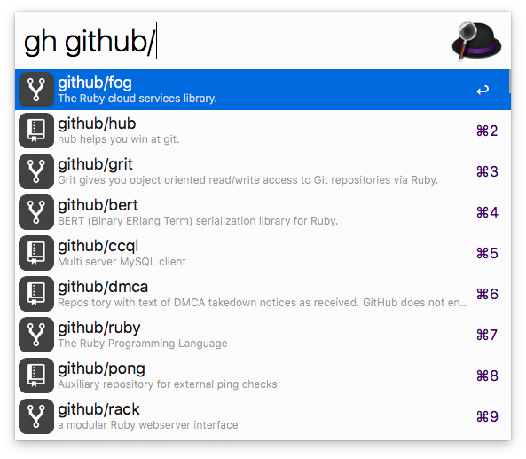

GitHub Workflow for [Alfred](http://www.alfredapp.com)
============================

You can search through GitHub (`gh`) and your GitHub Enterprise instance (`ghe`).

**[DOWNLOAD](https://github.com/gharlan/alfred-github-workflow/releases)**

Setup
-----

This workflow requires PHP, which is no longer pre-installed since macOS 12 Montery.  
You can install it via [Homebrew](https://brew.sh) (`brew install php`).

### For github.com

In Alfred type (`gh > login`) to authenticate against your account. The login uses OAuth, so you do not have to enter your credentials.

### For github enterprise

1. In Alfred type (`ghe > url https://github.mycompany.com`)
2. Create a new Personal Access Token (`ghe > generate token` or `https://github.mycompany.com/settings/applications`). It only needs access to your repos. Copy this token to your clipboard.
3. In Alfred type (`ghe > login <paste token here>`)
4. You can now `ghe your_enterprise_repo_name`

### Access to private repositories in organizations

Organizations must approve this app, otherwise private repositories of that organization can not be accessed. Access can be requested [here](https://github.com/settings/connections/applications/2d4f43826cb68e11c17c).

Key Combinations
----------------

Key Combination        | Action
---------------------- | ------
`enter`                | Open entry in default browser
`cmd` + `c`            | Copy URL of the entry
`cmd` + `enter`        | Paste URL to front most app
`shift` or `cmd` + `y` | Open URL in QuickLook

Commands
--------

To search through your GitHub Enterprise instance replace `gh` by `ghe`.

### Repo commands

* `gh user/repo`
* `gh user/repo #123`
* `gh user/repo @branch`
* `gh user/repo *commit`
* `gh user/repo /path/to/file`
* `gh user/repo actions`
* `gh user/repo admin`
* `gh user/repo clone`
* `gh user/repo dev`
* `gh user/repo discussions`
* `gh user/repo graphs`
* `gh user/repo issues`
* `gh user/repo milestones`
* `gh user/repo network`
* `gh user/repo new issue`
* `gh user/repo new pull`
* `gh user/repo projects`
* `gh user/repo pulls`
* `gh user/repo pulse`
* `gh user/repo releases`
* `gh user/repo wiki`
* `gh user/repo projects`

### User commands

* `gh @user`
* `gh @user overview`
* `gh @user repositories`
* `gh @user stars`
* `gh @user gists`

### Search commands

* `gh s repo`
* `gh s @user`

### "My" commands

* `gh my dashboard`
* `gh my notifications`
* `gh my profile`
* `gh my issues`
* `gh my issues created`
* `gh my issues assigned`
* `gh my issues mentioned`
* `gh my pulls`
* `gh my pulls created`
* `gh my pulls assigned`
* `gh my pulls mentioned`
* `gh my pulls review requested`
* `gh my repos`
* `gh my repos new`
* `gh my settings`
* `gh my stars`
* `gh my gists`

### Workflow commands

* `gh > login`
* `gh > logout`
* `gh > delete cache`
* `gh > delete database`
* `gh > update`
* `gh > activate autoupdate`
* `gh > deactivate autoupdate`
* `gh > help`
* `gh > changelog`
* `ghe > url` (GitHub Enterprise only)
* `ghe > generate token` (GitHub Enterprise only)
* `ghe > enterprise reset` (GitHub Enterprise only)
